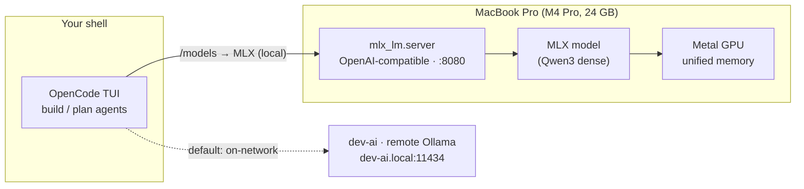

# Local agentic AI on the Mac: MLX + OpenCode

A reproducible recipe for a fully on-device coding agent on Apple Silicon — an
MLX-served LLM behind an OpenAI-compatible endpoint, driving
[OpenCode](https://opencode.ai) in the terminal. Nothing leaves the machine,
which is the point if you care about privacy, latency, or offline work.

In this repo, MLX is the **private/offline fallback** for the locked-down
**M4 Pro / 24 GB MacBook** (the only Apple Silicon target in the fleet — the
Razer is AMD/RTX and can't run MLX). The capability-first default is the remote
Ollama box (`dev-ai` / `dev-ai.local`); switch to MLX with `/models` when you're
off-network or want everything on-device.

> Everything below is already wired into the repo: the `mlx` provider in
> [`opencode.jsonc`](../opencode.jsonc) and the launcher at
> [`scripts/mlx-serve.sh`](../scripts/mlx-serve.sh). You install the repo
> (`./install.sh`), make sure `mlx-lm` is present, and run the launcher.

**Source / inspiration:** Apple WWDC26 Session 232 — *Run local agentic AI on the
Mac using MLX* (<https://developer.apple.com/videos/play/wwdc2026/232/>). The
config here is a corrected, annotated version of that session's **Code** tab,
with the model-naming and memory-budget gotchas the talk glosses over.

---

## TL;DR

- `mlx_lm.server` gives you an OpenAI-compatible endpoint on `127.0.0.1:8080`; the
  `mlx` provider in `opencode.jsonc` already points at it.
- On a **24 GB** machine the binding constraint **isn't the weights, it's KV-cache
  headroom**. Pick a dense 8 B (8-bit) or 14 B (4-bit) model — never a 30 B MoE.
- The thing that OOMs is the **prompt cache**, not the weights. The launcher bounds
  it with `--prompt-cache-bytes`; there is no `--kv-bits` in `mlx-lm 0.31.x`.
- "Thinking" is a **mode**, not a capability tier. Keep the server thinking-enabled
  and toggle per request with Qwen3's `/think` · `/no_think`, or bind those to the
  **plan** / **build** agents (Tab).
- A local model is run for the privacy/offline posture — even the biggest thing a
  24 GB box serves is a different league from a frontier cloud model. Calibrate
  accordingly, and lean on the remote box (`dev-ai`) for heavy lifting.

---

## Architecture



---

## Prerequisites

- Apple Silicon Mac, recent macOS (this fleet's target: M4 Pro / 24 GB, macOS 26).
- Python 3.11+ with `mlx-lm` installed (already present on the target Mac):

  ```bash
  pip install mlx-lm          # if you ever need to (re)install
  mlx_lm.server --help        # sanity check it's on PATH
  ```

- [OpenCode](https://opencode.ai) installed:

  ```bash
  brew install opencode        # cleanest on a Homebrew box
  # or: npm i -g opencode-ai@latest
  # or: curl -fsSL https://opencode.ai/install | bash
  opencode --version
  ```

- This repo installed into `~/.config/opencode` (`./install.sh` — see the
  [README](../README.md)). That puts the `mlx` provider and `mlx-serve.sh` in place.

---

## Step 1 — Start the MLX server

The launcher's defaults are sized for 24 GB. Run it when you want the local
backup; Ctrl-C when you're done.

```bash
~/.config/opencode/scripts/mlx-serve.sh
# ▶ lmstudio-community/Qwen3-8B-MLX-8bit on 127.0.0.1:8080  (KV ≤ 3 GiB, think=true)
```

`caffeinate -i` keeps the Mac awake only while it's serving (no global sleep
change). Every knob is env-overridable — see [Operations](#operations) below.

> ⚠️ **Naming gotcha — read this before you wait on a multi-GB download.** Use a
> real, text-only repo id. The WWDC slide's `mlx-community/Qwen-3.5-4B-8bit` does
> **not resolve** — and Hugging Face returns `401 Unauthorized` (not `404`) for
> unknown public repos, so a wrong name *looks* like an auth failure ("Invalid
> username or password") when the repo simply doesn't exist. The real convention
> has **no hyphen after `Qwen`** and an `MLX` segment, e.g. `Qwen3-8B-MLX-8bit`.
> Many `Qwen3.5-*` builds are `mlx_vlm` (vision) conversions — `mlx_lm.server`
> wants a **text** model, so prefer `lmstudio-community/Qwen3-*-MLX-*`. If a
> *valid* name still 401s, you have a stale credential: `hf auth whoami`, then
> `unset HF_TOKEN` (or `hf auth logout`) to fall back to anonymous downloads.

---

## Step 2 — Verify inference before touching the agent

A finished download does **not** prove the model loads and generates. In a second
terminal:

```bash
curl -s http://127.0.0.1:8080/v1/chat/completions \
  -H "Content-Type: application/json" \
  -d '{"model":"default_model","messages":[{"role":"user","content":"Hello!"}]}' | jq .
```

You want a real `choices[0].message.content` back. `default_model` is the server's
fixed alias for whatever you passed to `--model` — leave it as is (it's also the
model id in the `mlx` provider).

---

## Step 3 — Select the model in OpenCode

The provider is already configured. Just pin it:

```bash
cd /path/to/project
opencode
# then: /models  →  MLX (local)  →  Default MLX Model
```

> ⚠️ **Routing gotcha.** OpenCode remembers the last model *per project* and will
> happily run on the **remote** (or a cloud) model if you don't pin MLX — your
> local box sits idle while work runs elsewhere. **Ground truth is the server
> pane:** every agent turn should log a `POST /v1/chat/completions … 200`. If it's
> silent, you're not on MLX. Don't set a global `"model": "mlx/default_model"` in
> `opencode.jsonc` — you don't want a tiny model as your everywhere-default; this
> repo keeps the remote box as the default on purpose.

First real test: prompt something that forces a tool call — *"list the files in
this directory and tell me what this project does."* If the model fires the
file/bash tools, the loop works. If it *narrates* the edit instead, the model is
too small (step up, or see [Thinking](#thinking-vs-non-thinking)).

---

## Model options (24 GB budget)

A 4 B validates the pipeline but frustrates as a real agent — OpenCode leans hard
on repeated tool calls, and small models emit malformed/narrated calls. Residency
figures are approximate (weights + overhead, before KV cache):

| Repo | Quant | ~Resident | Role on 24 GB | Notes |
|---|---|---|---|---|
| `lmstudio-community/Qwen3-4B-MLX-8bit` | 8-bit | ~4.3 GB | Pipeline validation | Cheap; shaky at sustained tool calls |
| `lmstudio-community/Qwen3-8B-MLX-8bit` | 8-bit | ~9 GB | **Default / sweet spot** | Real tool-calling competence; leaves room for KV on 24 GB |
| `lmstudio-community/Qwen3-14B-MLX-4bit` | 4-bit | ~8 GB | Higher fidelity | Comparable residency to 8B-8bit, more capable; keep KV tight |
| `lmstudio-community/Qwen3-14B-MLX-8bit` | 8-bit | ~15 GB | **Too tight on 24 GB** | KV-starved — only if you free memory and keep contexts short |
| `lmstudio-community/Qwen3-Coder-30B-A3B-Instruct-MLX-8bit` | 8-bit | ~32 GB | **Won't fit** | MoE keeps the full 30 B resident; belongs on the remote box |

### Why KV cache is the real constraint on 24 GB

- macOS caps Metal at roughly **75% of unified memory** (~18 GB on a 24 GB
  machine). After the OS and apps, your real working budget is in the low-to-mid
  teens of GB.
- The trap isn't weight size, it's leaving room for **KV cache**, which grows with
  context — and agent sessions pile up long contexts fast from tool results and
  file reads.
- **MoE "active params" marketing does not reduce residency.** A 30B-A3B keeps the
  *full* 30 B of weights in memory; only compute is sparse. On 24 GB there's
  nothing left for KV — you'll stall on the second or third long turn. Run MoE on
  the remote `dev-ai` box instead.
- Qwen3 is 32K context natively (≈131K with YaRN). Don't crank max context on a
  constrained box — a bigger window just lets the KV cache grow faster.

---

## Operations

Treat this server as a **local backup to the remote box**, not an always-on
daemon: launch it when you want it, let it sleep otherwise.

### Why it OOMs (and the flags that stop it)

The weights are fixed at load — they don't grow. What kills a long-running
`mlx_lm.server` is the **prompt cache**: retained KV from prior turns, which
accumulates until it blows past the Metal wired limit and the process dies on a
failed allocation, usually mid-task. `mlx-lm 0.31.x` has **no `--kv-bits` or
`--max-kv-size`**; the real levers (all set by the launcher) are:

| Flag | What it does |
|---|---|
| `--prompt-cache-bytes N` | Hard ceiling on total KV-cache bytes. **The OOM guard** — caches evict instead of growing unbounded. |
| `--prompt-cache-size N` | Max number of distinct cached prompts held at once. Lower = tighter memory, fewer warm prefixes. |
| `--max-tokens N` | Default cap on generation length per request. |
| `--temp 0.0` | Greedy decoding — what you want for coding determinism. |
| `--chat-template-args '{"enable_thinking":true}'` | Keep thinking **enabled** so Qwen3's per-request `/think` · `/no_think` switches work. `false` hard-disables and kills the switch. |

These bound the *retained* cache — the chronic, runs-for-hours OOM. A single
pathological mega-context can still spike the active working set, so pair the
ceiling with a right-sized model and don't feed it 100 K-token prompts.

### Launcher env overrides

[`scripts/mlx-serve.sh`](../scripts/mlx-serve.sh) reads these (defaults shown are
the 24 GB target):

| Env var | Default | Purpose |
|---|---|---|
| `MLX_MODEL` | `lmstudio-community/Qwen3-8B-MLX-8bit` | Model repo id |
| `MLX_HOST` | `127.0.0.1` | `0.0.0.0` to share over Tailscale/LAN |
| `MLX_PORT` | `8080` | Server port |
| `MLX_CACHE_BYTES` | `3221225472` (3 GiB) | Hard KV-cache ceiling |
| `MLX_CACHE_SLOTS` | `2` | Max distinct cached prompts |
| `MLX_MAX_TOKENS` | `4096` | Per-request generation cap |
| `MLX_THINK` | `true` | Keep Qwen3 `/think` · `/no_think` switches alive |

```bash
# 24 GB MacBook (defaults)
./mlx-serve.sh

# Squeeze more capability, tighter KV
MLX_MODEL=lmstudio-community/Qwen3-14B-MLX-4bit MLX_CACHE_BYTES=2147483648 ./mlx-serve.sh

# Share this Mac's server with other nodes on the tailnet
MLX_HOST=0.0.0.0 ./mlx-serve.sh   # → point clients at http://<tailnet-ip>:8080/v1
```

> Want it *always* on? Wrap the same command in a launchd plist with `KeepAlive`.
> For a remote-primary workflow, on-demand is simpler and frees the memory when
> you're not using it.

### Optional: faster decode with speculative decoding

Decode is memory-bandwidth-bound. A small same-family draft model lifts tokens/sec
at the cost of keeping the draft resident too — add to the launcher's `exec` line
only when you have headroom (tight on 24 GB):

```bash
  --draft-model lmstudio-community/Qwen3-0.6B-MLX-8bit --num-draft-tokens 4
```

---

## Thinking vs. non-thinking

"Thinking" is a **mode**, not a model class. Qwen3 dense models are hybrid
reasoners — one set of weights, an explicit reasoning pass you gate on or off.
Turning thinking off does **not** demote a 8 B to a smaller model; it just stops
spending tokens on a scratchpad.

- **Plan / analysis / hard one-shot reasoning** → thinking **on**. Architecture
  decisions, gnarly algorithms, "why is this race condition happening."
- **The tool-call grind** → thinking **off**. Every read/edit/bash round-trip
  front-loads a think trace; latency compounds, traces eat the KV cache you're
  rationing, and Qwen3 sometimes *thinks instead of* emitting the tool call (the
  "narrates the edit" failure).

### Turning it on and off, fully local

Run the server **thinking-enabled** (`MLX_THINK=true`, the launcher default).

- **Type it (reliable).** Write `/think` or `/no_think` into your message; the most
  recent switch wins and *carries through the whole autonomous loop* until your
  next message. `implement X /no_think` keeps the entire edit-test-fix loop lean;
  `figure out why Y fails /think` reasons the whole way through.
- **Tab toggle (bind it to agents).** OpenCode's Tab cycles primary agents, each
  with its own `prompt`/`model`/`temperature`. The optional `agent` block in
  [`opencode.jsonc`](../opencode.jsonc) (commented out) points both built-ins at
  the one local model and differentiates by a leading soft switch — uncomment it
  when MLX is your primary:

  ```jsonc
  "agent": {
    "build": { "model": "mlx/default_model", "temperature": 0,
               "prompt": "/no_think\nYou are the build agent. Execute with tools; act, don't deliberate." },
    "plan":  { "model": "mlx/default_model", "temperature": 0,
               "prompt": "/think\nYou are the plan agent. Reason through the approach; read-only." }
  }
  ```

> Two caveats, both worth a quick test: **(1)** a custom `prompt` likely *replaces*
> the agent's default system prompt — if `build`'s tool-calling degrades after
> enabling it, drop its prompt override and use the typed `/no_think`. **(2)**
> OpenCode defaults **Qwen models to temperature 0.55**, not 0 — the
> `"temperature": 0` above pins deterministic coding and is worth setting
> regardless.

---

## Multi-Mac (optional): serve over Tailscale

The server binds to loopback by default. To reach it from other nodes, bind to all
interfaces and hit the host's Tailscale IP — keeps everything on the tailnet:

```bash
MLX_HOST=0.0.0.0 ./mlx-serve.sh
```

Point each client's `mlx` provider `baseURL` at
`http://<host-tailscale-ip>:8080/v1` instead of `127.0.0.1`. For models too large
for one machine, see WWDC26 Session 233 (*distributed inference with MLX*,
`mlx.launch`) — and verify the exact repo id exists before a long download, same
naming defect as Step 1.

---

## Remote Ollama (`dev-ai`) — the default, and its gotchas

The capability-first default is the remote Ollama box `dev-ai` (`dev-ai.local`,
`192.168.7.235`). The `dev-ai` provider in `opencode.jsonc` already points at it.
Two access patterns, depending on whether the Mac can see the box directly:

**Direct on the LAN (current config).** When the Mac and the rig share a network,
the provider hits `http://dev-ai.local:11434/v1` directly. Verify:

```bash
curl -s http://dev-ai.local:11434/v1/models | jq -r '.data[].id'   # lists the rig's models
```

**SSH tunnel (locked-down / off-LAN / privacy).** When the enterprise MacBook
*can't* route to the rig directly, or you don't want Ollama exposed on the LAN at
all, forward the port over SSH instead — the rig's Ollama can stay bound to
`127.0.0.1`, nothing published:

```bash
# forward local 11434 → the rig's 11434; -N = tunnel only, no remote shell
ssh -N -L 11434:dev-ai.local:11434 dev-ai
```

With the tunnel up, point the `dev-ai` provider's `baseURL` at
`http://127.0.0.1:11434/v1` instead. Leave the `ssh -N -L` running in its own
pane; if it drops, requests fail like a dead server would — bring it back up.

> ⚠️ **The gotcha that silently breaks agent mode.** Ollama defaults `num_ctx` to
> **4 K**, and OpenCode's tool definitions alone overflow that — so the model just
> *chats and never edits*, with no error. Set **`OLLAMA_CONTEXT_LENGTH=32768`** on
> the rig (or `num_ctx 32768` in a Modelfile) so tool-calling works. Two more:
> always use the **`/v1`** (OpenAI-compatible) path, never `/api`; and match the
> model id in `opencode.jsonc` to the **exact tag** from `ollama list` — Ollama
> tags use a colon (`qwen3.6:35b-a3b`), not a hyphen.

---

## Troubleshooting

| Symptom | Cause | Fix |
|---|---|---|
| `401 Unauthorized` / "Invalid username or password" on model load | Repo id doesn't exist (HF masks unknown repos as 401) | Verify the exact repo id; fix `Qwen-3.5-*` → `Qwen3-*-MLX-*` naming |
| Valid repo still 401s | Stale `HF_TOKEN` | `hf auth whoami`; `unset HF_TOKEN` / `hf auth logout` |
| Model loads but errors on text gen | Pulled an `mlx_vlm` (vision) repo | Use a text repo for `mlx_lm.server` |
| Box idle, server pane silent while agent "does something" | OpenCode is on the remote/cloud model | Pin MLX in `/models`; watch the pane for `POST … 200` |
| Server returns 200s but the TUI just spins | Model too small for tool calls | Step up to 8 B 8-bit / 14 B 4-bit dense |
| Server dies mid-task after running a while | Prompt cache grew past the Metal limit | The launcher's `--prompt-cache-bytes`/`--prompt-cache-size` cap it; right-size the model |
| `mlx_lm.server: command not found` | `mlx-lm` not installed / not on PATH | `pip install mlx-lm`; check the active Python env |
| Default model unreachable on the Mac | Remote box (`dev-ai` / dev-ai.local) off-network or down | Start MLX and `/models → MLX (local)`, or set `model` to `mlx/default_model` |
| `dev-ai` agent just chats, never edits | Ollama `num_ctx` at 4K default — OpenCode's tool defs overflow | Set `OLLAMA_CONTEXT_LENGTH=32768` on the rig (or `num_ctx 32768` in a Modelfile) |
| `dev-ai` 404s / model not found | Wrong path or mismatched tag | Use the `/v1` path (not `/api`); match the exact `ollama list` tag (colon, e.g. `qwen3.6:35b-a3b`) |
| Can't reach `dev-ai.local` from the locked-down Mac | No LAN route to the rig | Tunnel: `ssh -N -L 11434:dev-ai.local:11434 dev-ai`, then point the provider at `127.0.0.1:11434/v1` |

---

## References

- WWDC26 · Session 232 — *Run local agentic AI on the Mac using MLX*: <https://developer.apple.com/videos/play/wwdc2026/232/>
- WWDC26 · Session 233 — *Explore distributed inference and training with MLX*: <https://developer.apple.com/videos/play/wwdc2026/233>
- WWDC25 · Session 298 — *Explore large language models on Apple silicon with MLX*: <https://developer.apple.com/videos/play/wwdc2025/298>
- MLX-LM: <https://github.com/ml-explore/mlx-lm> · OpenCode: <https://opencode.ai>

---

*Adapted from the WWDC26 Session 232 walkthrough plus hands-on debugging. Residency
and timing figures are approximate and hardware-dependent.*
